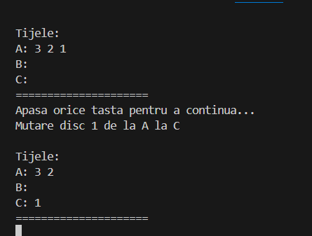

# Proiect: Turnurile din Hanoi

## Detalii despre Implementare
Acest proiect implementează jocul "Turnurile din Hanoi" folosind limbajul de programare C++. Aplicația utilizează un algoritm recursiv pentru a rezolva problema și afișează pașii necesari pentru a muta discurile între turnuri.

### Structura Proiectului
- **main.cpp**: Codul sursă principal care implementează logica jocului.
- **Dockerfile**: Configurarea necesară pentru a construi imaginea Docker a aplicației.
- **.gitlab-ci.yml**: Configurația pipeline-ului CI/CD pentru GitLab.
- **.gitignore**: Listează fișierele și directoarele care trebuie ignorate de Git.

## Platforma Software Utilizată
- **Limbaj**: C++
- **Compilator**: GCC (GNU Compiler Collection)
- **Platformă CI/CD**: GitLab
- **Docker**: Utilizat pentru containerizare și livrarea aplicației

### Configurații Software Necesare
1. **Docker**
   - Asigură-te că Docker este instalat pe mașina ta locală.
   - Comanda pentru instalare:
     ```bash
     sudo apt install docker.io
     ```
2. **GitLab CI/CD**
   - Pipeline-ul automat pentru build, push și deploy este configurat în `.gitlab-ci.yml`.
3. **G++**
   - Necesită G++ pentru compilarea manuală a codului dacă nu folosești Docker:
     ```bash
     sudo apt install g++
     ```

## Rezultate
Programul afișează pașii necesari pentru rezolvarea problemei Turnurilor din Hanoi pentru orice număr de discuri introdus de utilizator. 

Exemplu de ieșire pentru 3 discuri:
```
Introduceți numărul de discuri: 3
Mută discul 1 de pe A pe C
Mută discul 2 de pe A pe B
Mută discul 1 de pe C pe B
Mută discul 3 de pe A pe C
Mută discul 1 de pe B pe A
Mută discul 2 de pe B pe C
Mută discul 1 de pe A pe C
```

## Modalitate de Rulare

### Rulare Locală (Fără Docker)
1. Compilează codul folosind G++:
   ```bash
   g++ -o turnuri_hanoi main.cpp
   ```
2. Rulează aplicația:
   ```bash
   ./turnuri_hanoi
   ```

### Rulare folosind Docker
1. Construiește imaginea Docker:
   ```bash
   docker build -t turnuri_hanoi:latest .
   ```
2. Rulează containerul:
   ```bash
   docker run -it --rm turnuri_hanoi
   ```
### Rulare din terminal
1. Imaginea Docker:
   ```bash
   docker pull immbianca/turnuri_hanoi
   ```
2. Rulează containerul:
   ```bash
   docker run -it --rm immbianca/turnuri_hanoi
   ```
### Rulare Automată prin GitLab CI/CD
1. Fă un commit al codului în branch-ul principal (`main`).
2. Pipeline-ul GitLab va face automat următoarele:
   - Construiește imaginea Docker.
   - Împinge imaginea în **Github**.

## Captură de Ecran

   - Aceasta este o captură de ecran demonstrativă cu rularea aplicației în linia de comandă.
